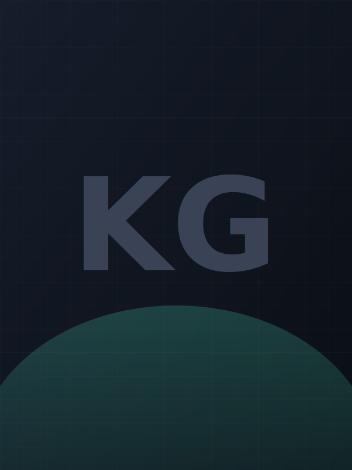

# Kapil Gadhire | Portfolio

A static site. No build step, no framework, no dependencies.

```
portfolio/
├── index.html
├── css/style.css
├── js/main.js
└── assets/
    ├── profile-placeholder.svg      ← swap this for a real photo
    ├── favicon.svg
    ├── kapil-gadhire-resume.pdf     ← linked from the "Resume" button
    ├── whitepaper-beyond-the-season.pdf
    └── case-study-mountain-west.pdf  (compressed from 66MB to 8.4MB for the web)
```

## 1. Add your photo

Open `index.html`, find this line in the hero section:

```html

```

Drop your photo into `assets/` (e.g. `assets/kapil.jpg`) and change `src` to point at it:

```html

```

The frame is a 3:4 portrait crop with `object-fit: cover`, so a normal headshot
will fill it cleanly without any other changes.

## 2. Run it locally

No npm install, no build. Pick one:

**Python (already on most machines):**
```bash
cd portfolio
python3 -m http.server 8080
```
Open http://localhost:8080

**Node, if you'd rather:**
```bash
cd portfolio
npx serve .
```

Opening `index.html` directly by double-clicking also works for a quick look,
though a local server is more accurate (fonts and the PDF links behave
exactly like production).

## 3. Deploy to Vercel

This is a static site, so Vercel needs no build command and no framework
preset.

**Easiest path, from the command line:**
```bash
cd portfolio
npx vercel
```
Answer the prompts (it will auto-detect "Other" / static), and it will give
you a live URL. Run `npx vercel --prod` when you're happy with it.

**Or through the Vercel dashboard:**
1. Push this folder to a GitHub repo.
2. In Vercel, "Add New Project" → import that repo.
3. Framework Preset: "Other". Build Command: leave blank. Output Directory: leave blank (or `.`).
4. Deploy.

## Notes

- The Mountain West case study PDF was compressed from the original 66MB
  down to 8.4MB (image quality lightly reduced) so it loads reasonably fast
  on the web. The full-quality original is still on your machine if you'd
  rather swap it in.
- The "Resume" button in the nav links to `assets/kapil-gadhire-resume.pdf`,
  a copy of the resume you uploaded. Replace that file whenever your resume
  updates, no HTML changes needed.
- Contact section currently shows email + LinkedIn + city. Your phone
  number from the resume was intentionally left off the public site to
  limit spam exposure. Add it to the `.contact-links` block in `index.html`
  if you'd rather have it visible.
- Everything is plain HTML/CSS/JS so any further edits (copy, colors, the
  timeline data in `js/main.js`) are plain-text changes, no rebuild required.
